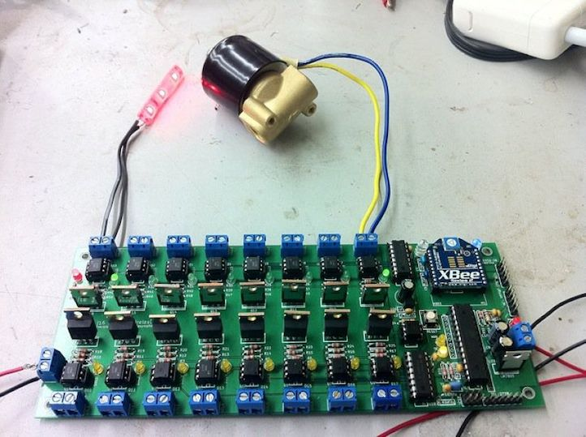

wifire16
--------

After I wired up 16 MOSFET + optoisolator circuits on perfboard for Flux and Fire, I swore I was never going to do it by hand again. When it came time to make a similar circuit for Super Street Fire, I decided the only option was to make a PCB to wirelessly control 16 flame effects. The end result: the wifire16 board.

### Feature Summary

* Arduino compatible
* Programmable via 6-pin FTDI header or 6-pin ICSP header
* 16 PWM-capable DC load channels switched via MOSFET
* Wireless support with XBee or compatible radio, e.g. RN-XV WiFly
* All ATMega I/O pins are broken out on the board
* DC load power is optoisolated from the control system power
* Power connectors use 5mm screw terminals or Anderson Powerpole connectors
* Load power status is reported to the microcontroller via an optoisolated input pin
* Output power channels are controlled with a TLC5940 constant current driver that works like a shift register
* Each output channel has a status LED for easy debugging
* TLC5940 control lines are broken out to input/output headres, so boards can be chained without additional control systems

### Design

The wifire16 takes two power inputs: 7-12 volts for the control side, and anything (within reason, e.g. 12 or 24 volts) for the load side. The control system acts exactly like an Arduino with attached XBee/WiFly radio, and is electrically optoisolated from the load side.The independent microcontroller (ATMega328P) on the board can control the power output channels via a pre-programmed routine, interactively over a wireless link, or with external sensors attached to the I/O pins. If more than 16 channels are needed, multiple boards can be chained together and controlled in the same way, with only one control system necessary.

The original purpose of the wifire16 is to control DC-powered solenoid valves for flame effects. The isolation of the two power sources protects the control side from the higher voltage load side, and also allows the load side power to be cut (i.e. by an arming or deadman switch) without affecting the control system. While the system was intended to handle solenoid valves that require 1A+ per channel, it can also be used to control anything else that needs DC power, e.g. motors or 12v LED rope lighting.

### v1 Note

The deprecated v1 version of this board used regular 74595 shift registers and were not PWM capable on all output channels. It also did not have Anderson Powerpole connnectors.

### Documents

* [Schematic](docs/wifire16-schematic.pdf)
* [Bill of Materials](docs/wifire16-BOM.csv)